# Keyboard

**A powerful Model Context Protocol (MCP) server for secure task execution directly in your AI Client.**

[](https://docs.keyboard.dev/) [](LICENSE) [](https://discord.gg/UxsRWtV6M2)

## What is Keyboard? 

Keyboard is a universal Model Context Protocol (MCP) server designed to transform how you interact with AI clients like Claude. It provides a flexible and secure platform for connecting your internal applications to your AI client and executing complex tasks across various domains via direct code execution and task automation

## 🚀 Quick Demo


## How does it work

### How it works in 3 steps:

1. **Ask Claude** to execute a task using your connected tools
2. **Review & approve** the generated code in the desktop app
3. **Watch it execute** safely in your own GitHub Codespace

```mermaid
flowchart LR
    A[📱 Claude Request] -->|"Send email via Gmail"| B[🔍 Keyboard Generates Code]
    B -->|📋 Shows preview| C[✅ You approve/reject]
    C -->|✅ Approved| D[☁️ Executes in Codespace]
    D -->|📊 Results| A
```



### Full breakdown

Keyboard’s MCP server enables remote code execution in a GitHub codespace tied to your GitHub account that can then execute tasks in the connected apps via their APIs. When you ask your AI Client to have Keyboard  to execute a task for you, Keyboard spins up a codespace and writes a node.js script to execute that task for you. The AI Client will walk you through the steps it’s taking and you have the ability to approve any code before it gets executed in the AI Client on your behalf. Once the code is executed you then have the option accept or reject sending the response back to a MCP client like Claude to better ensure your privacy.

Ask Keyboard to do something for you in Claude and see for yourself! 

## When should I use Keyboard?

When you want your AI Client (Claude, ChatGPT, etc.) to execute tasks on your behalf. Connect your tools to your own secure GitHub Codespace, ask Claude to execute something in one of them and watch Keyboard go to work. With Keyboard, you don’t need to install an MCP server for each app or service you’d like to connect to your AI Client. Instead, any app with an API key can be connected to Keyboard while giving you control to approve or deny the actions.

## Key Features

- **Connect Your Tools:** One MCP, all your tools. Provide Keyboard access to third party tools in your own GitHub environment. 
- **Private:** Keyboard doesn't have access to your API keys, it only has access to the GitHub Codespace.
- **Secure Workflows:** Run code safely within your own controlled environment with human oriented approval workflows.  
- **Human Control:** You approve what code is executed, you also approve what data is sent is back to MCP clients like Claude.

## Quickstart

Keyboard is available to use today for free. See the [quickstart](https://docs.keyboard.dev/docs/quickstart) guide to get up and running quickly. 

## Documentation

Full docs can be found at https://docs.keyboard.dev/ but see below for direct links to a few docs that will help you use Keyboard after you get set up: 

* [Learn how to connect your third party apps](https://docs.keyboard.dev/docs/third-party-apps) 
* [Tips for using Keyboard with Claude](https://docs.keyboard.dev/docs/usability-tips-with-claude) 

## Get Started with this Repo

```bash
# Get access to both repos
git clone --recursive https://github.com/keyboard-dev/keyboard-local.git
cd keyboard-local

# Work on desktop electron app
cd apps/approver-client
git checkout main
git pull origin main
npm install && npm run dev


# Work on server (different terminal)
cd apps/keyboard-mcp
git checkout main
git pull origin main
npm install && npm run build
```

Once you have both repos, read the [quickstart](https://docs.keyboard.dev/docs/quickstart) in the docs for the comprehensive step by step.

## 🔥 Important: How to Contribute

✅ DO THIS:

* Make changes in apps/approver-client/ or apps/keyboard-mcp/
* Create branches and commits like normal
* Submit PRs to the individual repos:

Approver Client changes → https://github.com/keyboard-dev/approver-client

Keyboard MCP changes → https://github.com/keyboard-dev/keyboard-mcp

❌ DON'T DO THIS:

* Don't submit PRs to this monorepo (unless changing this README)
* Don't worry about "updating submodules" - handled automatically

That's It! Work like you normally would. This repo just saves you from cloning multiple repositories.

